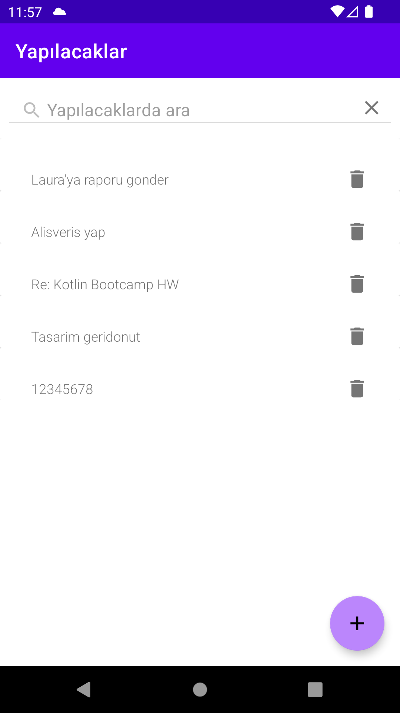
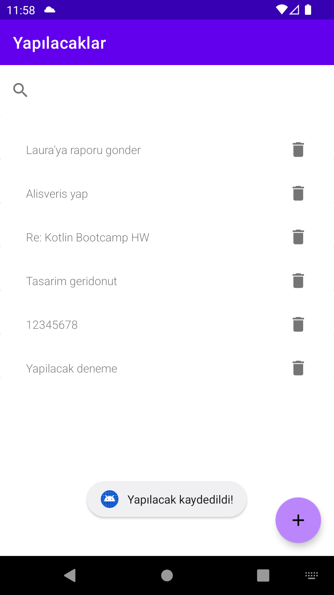
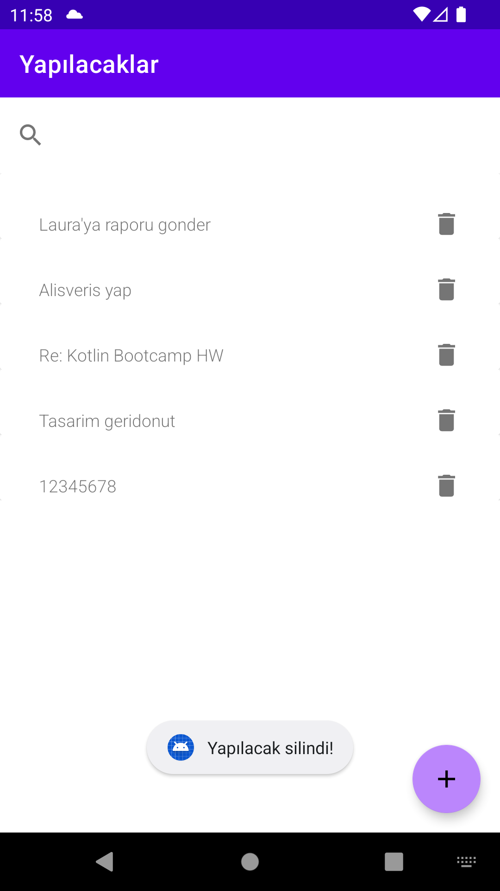

# ToDo App
 ToDo App with Kotlin using SQLite DB.
 
<table>
    <tr>
        <td>
        
        </td>
        <td>
        
        </td>
        <td>
        
        </td>
        <td>
        
        </td>
    </tr>
</table>